# Authentication Sequence Diagrams

This document contains sequence diagrams for the authentication flows in the Personal Task Prioritizer application.

## Authentication Flows

```mermaid
sequenceDiagram
    participant User
    participant Streamlit as Streamlit App
    participant SB as supabase_client.py
    participant Supabase as Supabase Auth API
    participant Email as Email Service

    %% Login Flow
    rect rgb(240, 240, 255)
    Note over User, Email: Login Flow
    User->>Streamlit: Enter email and password
    User->>Streamlit: Click "Login" button
    Streamlit->>SB: sign_in(email, password)
    SB->>Supabase: auth.sign_in_with_password()
    Supabase-->>SB: Return AuthResponse
    SB->>SB: Set session in client
    SB-->>Streamlit: Return user data
    Streamlit->>Streamlit: Store user in session_state
    Streamlit-->>User: Display success message
    Streamlit->>Streamlit: Rerun app with authenticated state
    end

    %% Signup Flow
    rect rgb(240, 255, 240)
    Note over User, Email: Signup Flow
    User->>Streamlit: Enter email, password, confirm password
    User->>Streamlit: Click "Sign Up" button
    Streamlit->>SB: sign_up(email, password)
    SB->>Supabase: auth.sign_up()
    Supabase->>Email: Send verification email (if configured)
    Supabase-->>SB: Return AuthResponse
    SB-->>Streamlit: Return user data
    Streamlit-->>User: Display success message
    Streamlit-->>User: Show instructions to verify email
    end

    %% Password Reset Flow - Request
    rect rgb(255, 240, 240)
    Note over User, Email: Password Reset Flow - Request
    User->>Streamlit: Navigate to "Reset Password" tab
    User->>Streamlit: Enter email
    User->>Streamlit: Click "Send Reset Link"
    Streamlit->>SB: reset_password(email)
    SB->>Supabase: auth.reset_password_email()
    Supabase->>Email: Send password reset email
    Supabase-->>SB: Return response
    SB-->>Streamlit: Return response
    Streamlit-->>User: Display success message
    Streamlit-->>User: Show instructions to check email
    end

    %% Password Reset Flow - Complete
    rect rgb(255, 240, 240)
    Note over User, Email: Password Reset Flow - Complete
    User->>Email: Open reset password email
    User->>Email: Click reset password link
    Email-->>Streamlit: Redirect to reset-password.py with token
    Streamlit->>Streamlit: Extract token from URL
    Streamlit->>Streamlit: Store token in session_state
    Streamlit-->>User: Display password reset form
    User->>Streamlit: Enter new password and confirm
    User->>Streamlit: Click "Reset Password"
    Streamlit->>SB: update_password(new_password)
    SB->>Supabase: auth.update_user()
    Supabase-->>SB: Return response
    SB-->>Streamlit: Return response
    Streamlit-->>User: Display success message
    User->>Streamlit: Click "Return to Login"
    Streamlit->>Streamlit: Clear query parameters
    Streamlit->>Streamlit: Rerun app
    end

    %% Google OAuth Flow
    rect rgb(255, 255, 240)
    Note over User, Email: Google OAuth Flow
    User->>Streamlit: Navigate to "Login with Google" tab
    User->>Streamlit: Click "Sign in with Google"
    Streamlit->>SB: sign_in_with_google()
    SB->>Supabase: auth.sign_in_with_oauth()
    Supabase-->>SB: Return OAuth URL
    SB-->>Streamlit: Return OAuth URL
    Streamlit-->>User: Display link to Google auth
    User->>Streamlit: Click Google auth link
    Streamlit-->>Supabase: Redirect to Google auth
    User->>Supabase: Authenticate with Google
    Supabase-->>Streamlit: Redirect back with auth parameters
    User->>Streamlit: Paste callback URL (if not auto-redirected)
    Streamlit->>Streamlit: Extract parameters from URL
    Streamlit->>SB: handle_auth_callback(params)
    SB->>Supabase: Process OAuth callback
    Supabase-->>SB: Return user data
    SB-->>Streamlit: Return user data
    Streamlit->>Streamlit: Store user in session_state
    Streamlit-->>User: Display success message
    Streamlit->>Streamlit: Rerun app with authenticated state
    end
```

## Explanation of Authentication Flows

### 1. Login Flow
- User enters email and password in the login form
- Streamlit calls `sign_in()` in supabase_client.py
- supabase_client calls Supabase Auth API
- Upon success, the user session is stored in session_state
- The app reruns in authenticated state

### 2. Signup Flow
- User enters email, password, and confirms password
- Streamlit calls `sign_up()` in supabase_client.py
- supabase_client calls Supabase Auth API
- Supabase sends a verification email if configured
- User is shown success message and instructions

### 3. Password Reset Flow (Request)
- User enters email in the reset password form
- Streamlit calls `reset_password()` in supabase_client.py
- supabase_client calls Supabase Auth API
- Supabase sends a password reset email
- User is shown success message and instructions

### 4. Password Reset Flow (Complete)
- User clicks the reset link in their email
- Browser opens reset-password.py with token in URL
- User enters new password and confirms
- Streamlit calls `update_password()` in supabase_client.py
- supabase_client calls Supabase Auth API
- User is shown success message and can return to login

### 5. Google OAuth Flow
- User clicks "Sign in with Google"
- Streamlit calls `sign_in_with_google()` in supabase_client.py
- supabase_client calls Supabase Auth API to get OAuth URL
- User is redirected to Google for authentication
- After authentication, user is redirected back with auth parameters
- Streamlit processes the callback and stores user session
